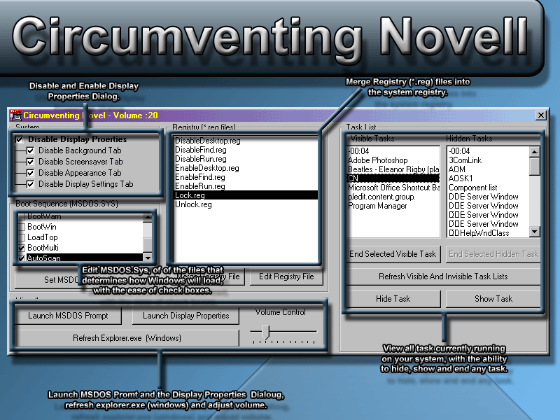

## Circumventing Novell

### Description

Ever need to get around the security setup by Novell? well this program may come in handy when trying to do just that. Edit msdos.sys file, disable/enable display properties, visible and invisble task list, registry file merger, referesh explorer.exe(windows) so effects can take place without restarting computer which would make you lose many of the changes. See screenshot.
 
### More Info
 

             |
---                |---
**Submitted On**   |2001-11-23 05:17:42
**By**             |[Kevin Matthews](https://github.com/Planet-Source-Code/PSCIndex/blob/master/ByAuthor/kevin-matthews.md)
**Level**          |Advanced
**User Rating**    |5.0 (25 globes from 5 users)
**Compatibility**  |VB 6\.0
**Category**       |[Complete Applications](https://github.com/Planet-Source-Code/PSCIndex/blob/master/ByCategory/complete-applications__1-27.md)
**World**          |[Visual Basic](https://github.com/Planet-Source-Code/PSCIndex/blob/master/ByWorld/visual-basic.md)
**Archive File**   |[Circumvent574172252002\.zip](https://github.com/Planet-Source-Code/kevin-matthews-circumventing-novell__1-32101/archive/master.zip)

### API Declarations

In Code

